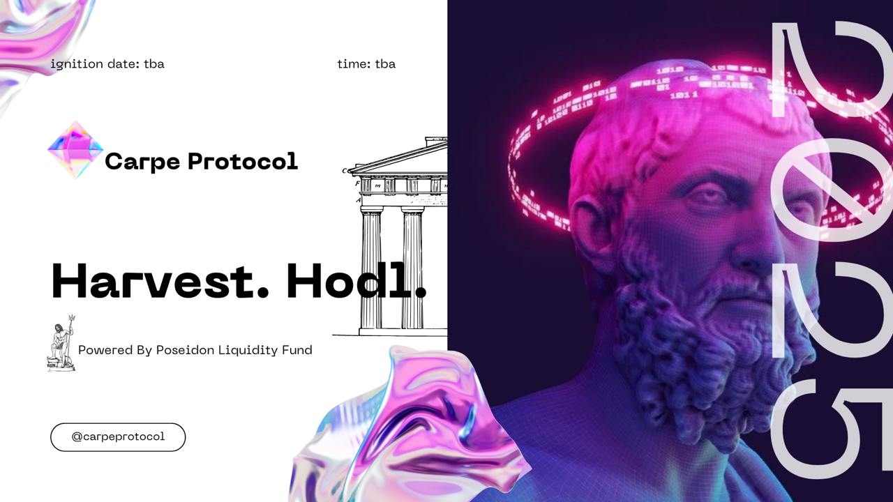
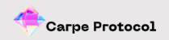
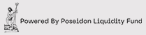

# Welcome to Carpe Protocol 🔱

**Where cutting-edge AI meets the wisdom of the ancients.**

Inspired by the gods and goddesses of Greek mythology, Carpe illuminates the Solana ecosystem with neon brilliance, empowering traders and developers to seize the market like Olympians. 🌊

Our mission is simple yet ambitious: to harness the power of advanced AI technology and harvest data from the Solana blockchain, delivering unparalleled insights that unlock the vast potential of Web3.

At Carpe, we believe in mastery through knowledge. Whether you're a trader seeking to outpace the competition or a developer looking to build the future, our platform equips you with the tools to stay ahead in the ever-evolving digital landscape.

**Seize the moment. Illuminate the path. Dominate the market.**

---

## 🔱 Projects

### 1. [Poiseidon: The God of Liquidity](#poiseidon-the-god-of-liquidity)

At the heart of Carpe lies **Poiseidon**, our revered God of Liquidity, whose domain is the ever-flowing ocean of capital within the Solana ecosystem. Poiseidon ensures the seamless movement of assets, safeguarding stability in even the most turbulent market conditions.

#### Poiseidon’s Powers:

- **Tidal Liquidity Pools:** Optimizes underutilized pools while maintaining equilibrium in high-volume trading pairs.
- **Surge Analysis:** Predicts liquidity crises or opportunities by monitoring sudden inflows and outflows.
- **Depth Synchronization:** Tracks cross-pool arbitrage potential to ensure optimal value across the ecosystem.
- **Trident Protocol:** Stabilizes market volatility by dynamically reallocating liquidity.
- **Reactive Pooling:** Redirects liquidity to high-demand assets during market surges.
- **Equilibrium Safeguards:** Maintains healthy spreads to deter manipulative practices like slippage exploitation.
- **The Abyss Fund:** A reserve vault acting as a safety net during liquidity droughts.
- **AI-Driven Allocation:** Deploys liquidity to underperforming tokens to revitalize market activity.
- **Crisis Containment:** Activates during major liquidity drains (e.g., rug pulls) to protect investments.
- **Whirlpool Analytics:** Visualizes liquidity dynamics in real time.
- **Wave Metrics:** Tracks liquidity flow across major pools and protocols.
- **Ripple Alerts:** Provides notifications for significant liquidity events (e.g., whale movements).

**Why Poiseidon Matters:**
Liquidity is the lifeblood of Web3. Poiseidon ensures smooth liquidity flow, empowering traders and developers to navigate the market confidently.

[Learn more about Poiseidon](#)

---

### 2. [Zeus: The Nexus of Knowledge](#zeus-the-nexus-of-knowledge)

At the pinnacle of Carpe stands **Zeus**, the all-seeing Nexus of Knowledge. Like the king of gods on Mount Olympus, Zeus governs the flow of information across the Solana ecosystem, wielding AI to deliver unparalleled insights.

#### Zeus’s Powers:

- **Olympian Vision:** Converts raw data into actionable intelligence.
- **Lightning Analytics:** Real-time analysis of transactions, token movements, and on-chain activity.
- **Cloud Atlas:** Maps developer activity, token ecosystems, and wallet behaviors into a connected web of knowledge.
- **Bolt Forecasting:** Predicts market trends and token volatility with precision.
- **Ecosystem Pulse:** Monitors Solana’s health with a heartbeat-like dashboard.
- **Thundercast Protocol:** Provides actionable predictions and insights.
- **Oracle Augmentation:** Combines on-chain and off-chain data for a 360° perspective.
- **Divine Alerts:** Real-time updates on breaking trends, whale activity, and high-value opportunities.
- **The Pantheon Dashboard:** A temple of knowledge with features like:
  - **Neon Oracle:** Visualizes complex metrics dynamically.
  - **Temporal Lightning:** Enables historical data exploration and future scenario simulations.
  - **Knowledge Scrolls:** Aggregated reports on tokenomics, developer trends, and protocol health.
  - **AI-Powered Guides:** Personalized recommendations based on user goals.

**Why Zeus Matters:**
Zeus empowers users with the knowledge to navigate the stormy skies of Web3, ensuring traders and developers stay ahead of the curve.

[Learn more about Zeus](#)

---

### 3. [The Olympian Framework](#the-olympian-framework)

The **Olympian Framework** unites divine-level AI, blockchain intelligence, and user-centric tools under one cohesive architecture. It’s where the powers of the gods meet modern technology to create a revolutionary Web3 experience.

#### Key Components:

- **Hermes Relay System:**

  - Ensures rapid and reliable communication across the platform.
  - **Dynamic Packet Routing:** Optimizes data flow based on demand.
  - **Latency-Zero Protocol:** Processes blockchain events in near real time.

- **Hephaestus Forge:**

  - Enables the creation of custom tools and algorithms.
  - **Forge Scripts:** Pre-built modules for tokenomics, liquidity, and arbitrage.
  - **Custom Toolkits:** Drag-and-drop AI workflow system for building bespoke tools.

- **Athena’s Wisdom AI:**

  - Adapts to user needs with predictive analytics.
  - **Deep Insight Modules:** Extract high-value data patterns.
  - **Evolving Neural Layers:** Adapts to market changes and user interactions.

- **Apollo’s Oracle Gateway:**

  - Integrates blockchain data with external trends.
  - **Cross-Realm Data Integration:** Combines DeFi metrics with fiat and social sentiment data.
  - **Illuminated Pathways:** Offers guided market predictions.

- **Hades Contingency Vault:**

  - Protects users during liquidity crises and market instability.
  - **Cataclysm Recovery Protocols:** Reallocates resources to maintain stability.
  - **Underworld Analytics:** Alerts users to market manipulation attempts.

- **Chronos Temporal Engine:**

  - Captures and analyzes data through a temporal lens.
  - **Time Fracture Metrics:** Visualizes data trends across timeframes.
  - **Eternal Rewind Function:** Identifies recurring patterns in historical data.

#### Advanced Features Only at Carpe:

- **The Neon Pantheon:** Greek-inspired neon visuals, blending mythology with a futuristic aesthetic.
- **Immortal Simulations:** AI-powered scenarios to test strategies under hypothetical market conditions.
- **Oath of Olympus:** A decentralized governance model where users earn voting power by contributing to the ecosystem.

**Why the Olympian Framework Matters:**
By combining the strategic brilliance of mythology with cutting-edge AI and blockchain, Carpe offers unparalleled tools for traders and developers to achieve mastery.

[Learn more about the Olympian Framework](#)

---

## 📡 Stay Connected

Stay updated and engage with us:

- [Website](https://carpeprotocol.xyz)
- [Twitter](https://x.com/carpeprotocol)

---

